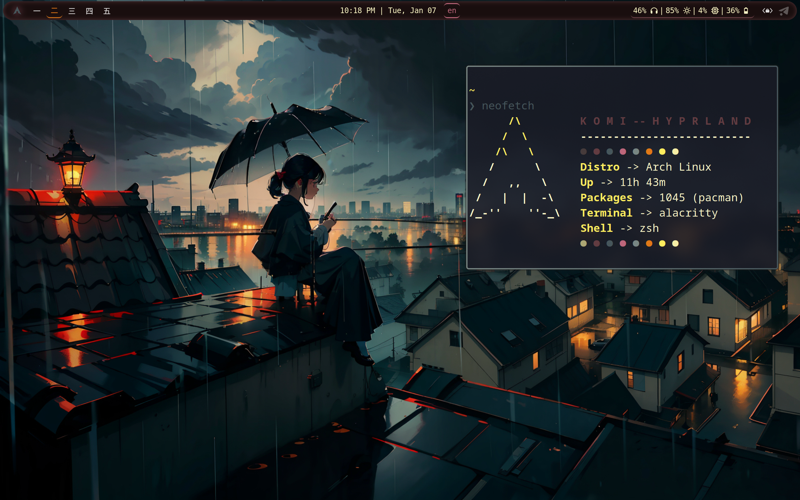
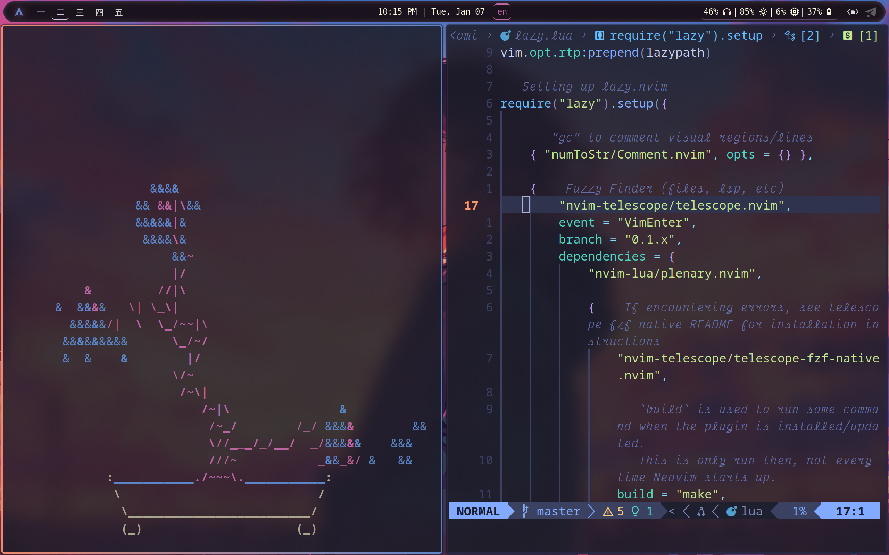

# Info
Dots for Komi's laptop
- **Window Manager** -> Hyprland
- **File Manager** -> Thunar
- **Notifications** -> Dunst
- **Terminal** -> Kitty
- **Panel** -> Waybar
- **Launcher and dmenu** -> Rofi
- **Editor** -> Neovim
- **Color schemes** -> Wallust

# Screenshots



</br>



</br>

# Installation
All the following steps could be applied to Arch and Arch-based system

## Main packages 
```sh
yay -S archlinux-keyring brightnessctl dunst grim \
gtk-engine-murrine hyprland hyprlang hypridle hyprlock \
hyprpicker-git kvantum kitty network-manager-applet neovim noto-fonts noto-fonts-cjk noto-fonts-emoji \
nerd-fonts pavucontrol pipewire pipewire-alsa pipewire-audio \
pipewire-jack pipewire-pulse polkit polkit-gnome polkit-qt5 \
qalculate-gtk rofi-lbonn-wayland slurp swww thunar \
thunar-archive-plugin waybar wayland wallust xdg-desktop-portal xdg-desktop-portal-hyprland zoxide \
wl-clipboard zsh zinit fzf starship ripgrep fileroller zip unzip
```
...and all of the dependencies

## Auxiliary packages
List of packages which I use but consider them replaceable with more of one's liking. Please consider that corresponding line in the config won't work if some package's not installed:

```sh
yay -S bibata-cursor-theme fastfetch gnome-keyring nwg-look hyprland-per-window-layout \
wl-clip-persist lsd qview colloid-catppuccin-gtk-theme-git tlp zen-browser-bin tmux
```

## Configuration files
1. Copy all folders/files to `$HOME/dotfiles` directory
2. Create symlinks in your `$HOME/.config` directory to:
    - kitty
    - dunst
    - nvim
    - hypr
    - kvantum
    - libinput-gestures.conf
    - fastfetch
    - rofi
    - waybar
    - wallust
    - tmux

(e.g `ln -s ~/dotfiles/kitty ~/.config/kitty`)
