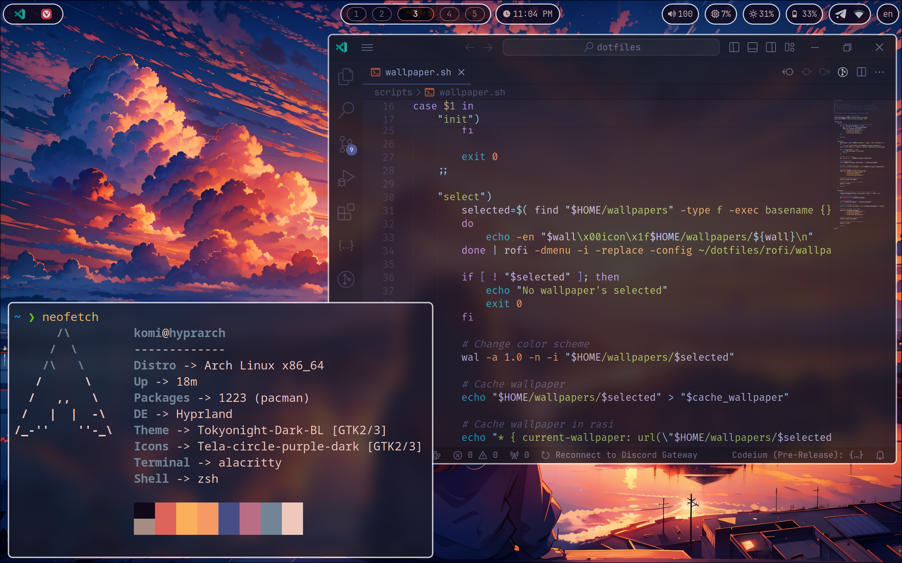

# Info
Configuration files for Komi's laptop
- **Window Manager** -> Hyprland
- **File Manager** -> Thunar
- **Notifications** -> Dunst
- **Panel** -> Waybar
- **Launcher and dmenu** -> Rofi
- **Terminal** -> Alacritty
- **Color schemes** -> Pywal

# Screenshots



</br>


# Installation
All the following steps could be applied to Arch and Arch-based system

## Main packages 
```sh
yay -S alacritty archlinux-keyring bibata-cursor-theme brightnessctl dunst grim \
gtk-engine-murrine helix hyprland hyprlang hypridle hyprlock \
hyprpicker-git kvantum neofetch noto-fonts noto-fonts-cjk noto-fonts-emoji \
nerd-fonts papirus-icon-theme pavucontrol pipewire pipewire-alsa pipewire-audio \
pipewire-jack pipewire-pulse python-pywal polkit polkit-gnome polkit-qt5 \
qalculate-gtk rofi-lbonn-wayland slurp swww tela-circle-icon-theme-purple thunar \
thunar-archive-plugin thunarx-python waybar wayland \
xdg-desktop-portal xdg-desktop-portal-hyprland zoxide zsh zsh-autocomplete \
zsh-syntax-highlighting
```
...and all of the dependencies

## Auxiliary packages
This is the list of packages that you might want to replace with something more of your liking or not to install at all. However here I go:

```sh
yay -S gnome-keyring vivaldi ruby-colorls nwg-look hyprland-per-window-layout
```

## Configuration files
1. Copy all folders/files to `$HOME/dotfiles` directory
2. Create symlinks in your `$HOME/.config` directory to:
    - alacritty
    - dunst
    - helix
    - hypr
    - kvantum
    - libinput-gestures.conf
    - neofetch
    - rofi
    - waybar

(e.g `ln -s ~/dotfiles/alacritty ~/.config/alacritty`)

# Changes in near future
- [ ] Cliphist (via rofi)
- [ ] Add few plugins

